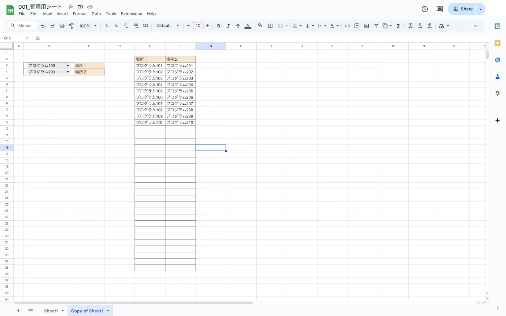

# イベント進行状況表示用デジタルサイネージ

## 仕様

Google Apps Scriptを利用してリアルタイムにイベントの進行状況を取得し、デジタルサイネージにその情報を表示します。

## 必須環境

- Google Apps Script
- Linux, Mac (Both of `aarch64` and `amd64/x86-64`)

## 利用方法

- GASのスプレッドシート上に次の画像のようなシートを作成してください。



- 作成したスプレッドシート上でコンテナのGASを作成し、['src/gas/main.js'](src/gas/main.js)に記載されているコードを入力してください。
- 作成したGASをWebアプリとしてデプロイします。デプロイしたURLはのちに使いますのでメモをしといてください。
- 表示したいサイネージの画面をHTMLとCSSで書いてください。なお、見本はBootstrapを利用しています。
- 次のコマンドでシングルバイナリを作成します。プロジェクトルートのディレクトリでターミナルを開いてください。

```bash
zip -r -0 src/bin/redbean.com src/web
```

- `src/bin`をデジタルサイネージとして利用したいコンピューターのダウンロードディレクトリに設置します。
- Macの方は、`src/bin/run.command`を実行してください。なお、デフォルトではSafariを開く設定になっています。
- マニュアルで実行する方は次のコマンドを利用してください。適宜`run.command`は編集してご利用ください。

```bash
cd ~/Downloads; ./redbean.com

open http://127.0.0.1:8080/src/index.html
```

- イベントの変更時はプルダウンを利用してください。

## ライブラリ

- Bootstrap ['LICENSE'](https://github.com/twbs/bootstrap/blob/v5.3.0/LICENSE)
- redbean ['LICENSE'](https://redbean.dev/)

## ライセンス

このリポジトリはMITライセンスにより保護されています。詳しくは[LICENSE.md](LICENSE.md)をご覧ください。


